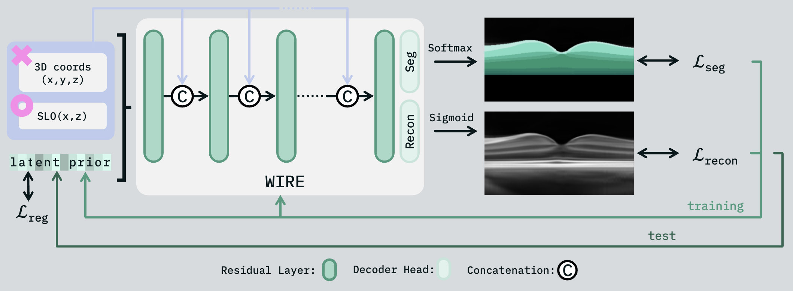
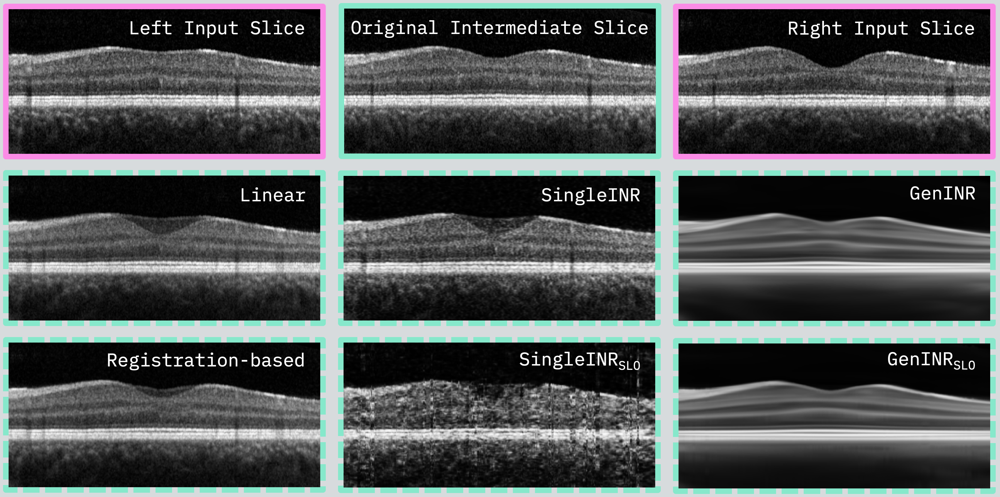

# Generalizable Implicit Neural Representations for Improved OCT Interpolation and Segmentation
The PyTorch implementation of the work [Bridging Gaps in Retinal Imaging - Fusing OCT and SLO Information with Implicit Neural Representations for Improved Interpolation and Segmentation](https://link.springer.com/chapter/10.1007/978-3-658-47422-5_24). 

|  |
|:------------------------:|
|   *Schematic overview*   |

This work uses generalizable implicit neural representations (INRs) to improve interpolation and retinal layer 
segmentation in optical coherence tomography (OCT). Usually, OCT scans have large slices distances, which can 
potentially miss small retinal structures and reduce measurement accuracy. Existing interpolation methods struggle 
with shape accuracy and missing data. By using population-based training, generalizable INRs improve shape 
representation with minimal annotated slices. The method also integrates scanning laser ophthalmoscopy (SLO) 
to enhance inter-slice information. Additionally, the generalizable INR adapts to new images, enabling segmentation of 
unseen cases.

## Prerequisites
- Linux 20.04
- Python 3.9
- NVIDIA GPU + CUDA CuDNN

### Packages
- PyTorch (2.1)
- numpy
- json
- SimpleITK
- SciPy
- ruamel
- matplotlib
- lpips
- scikit-image

&#8594; A requirements.txt will be added

## Getting Started
### Installation
- Clone this repository
- Install the necessary requirements

### Dataset
The dataset used for INteRp-OCT consists of 100 OCT and SLO images from 50 healthy volunteers (right and left eye) 
acquired with a Heidelberg Spectralis scanner. OCT and SLO images have a resolution of 496x512x512 (dense sampling in OCTA setting) and 768x768. 


### Preprocessing
Pre-processing of the OCT images consists of the following steps:
- Flattening at the Bruch's membrane
- B-scan-wise normalization to \[0,1\]
- Cropping of B-scans to size 230x496 
- Subsampling to 16 equidistant B-scans

&rarr; Resolution of OCT images used for training is 230x496x16 


SLO pre-processing:
- Subsampling to B-Scan positions (of original OCT volume)
- Normalization to \[0,1\]
- Cropping and subsampling

&rarr; Resolution of SLO images used for training is 496x16 


Data format:
For each fold, we organized our training and test images in .npz-files named
'dataset_flat_subsmpl32_train_fold{config.SETTINGS.FOLD}.npz'. For evaluation purposes, we used images 
sampled to 31 B-scans which are stored as 'dataset_flat_subsmpl16_test_fold{config.SETTINGS.FOLD}.npz'.
For our code to work, each .npz-container must have the following components:
- 'oct_vols': The training/test images in format \[num_samples, H, W, D\]
- 'seg_vols': The corresponding segmentation images in format \[num_samples, H, W, D\]
- 'slo_imgs': The corresponding SLO images in format \[num_samples, W, D\]
- 'subject_names': A list containing identifiers of your data

If you want to use a different data format, the following lines of code need to be adapted:
- In train_test_geninr.py: Lines 66 - 70, 217 - 235, 246
- In training.py: Lines 188 - 193
- In evaluation.py: Lines 165 - 171


## Usage
We provide two main scripts, one for the training and subsequent fitting to test images of the 
proposed generalizable INR and one to fit an INR on individual OCT plus SLO images. Both scripts
additionally perform an evaluation of the models. 

To run the scripts use the following commands:
```sh
python train_test_geninr.py ../configs/geninr_config.yaml --gpu 0
```
```sh
python train_test_single.py ../configs/singleinr_config.yaml --gpu 0
```

For both generalizable and single INR, we provide config-files with the settings used in the paper.
With the config-files you can define:

### **General Settings**
- **`SETTINGS.FOLD`**: The training/test fold  
- **`SETTINGS.RESULT_DIR`**: Directory to store results  
- **`SETTINGS.IMG_DIR`**: Directory containing dataset containers  

### **Training Settings**
- **`TRAINING.LATENT_CODE.SIZE`**: Number of elements in each latent vector  
- **`TRAINING.LATENT_CODE.INIT_STD`**: Standard deviation for initializing latent codes  
- **`TRAINING.SEED`**: Seed for random number initialization  
- **`TRAINING.LEARNING_RATE`**: Learning rate for optimization  
- **`TRAINING.TOTAL_EPOCHS`**: Maximum number of training epochs  
- **`TRAINING.EPOCHS_TIL_SUMMARY`**: Number of epochs before generating result plots  
- **`TRAINING.LOSS_RECON`**: Loss function for reconstruction (`MSE`, `SSIM`, or `combi`)  
- **`TRAINING.LOSS_WEIGHT_RECON`**: Weighting of the reconstruction loss  
- **`TRAINING.LOSS_WEIGHT_SEG`**: Weighting of the segmentation loss  
- **`TRAINING.INPUT_SLO`**: Whether SLO input is used (`True/False`)  

### **Model Settings**
- **`MODEL.NUM_LAYERS`**: Number of hidden layers in the INR  
- **`MODEL.HIDDEN_SIZE`**: Size of hidden network layers  
- **`MODEL.DROPOUT`**: Dropout rate during training  
- **`MODEL.ACTIVATION`**: Activation function (`SIREN`, `RELU`, `WIRE`, `FINER`)  
- **`MODEL.SKIP_CONNECTION`**: Use of skip connections inside the network (`True/False`)  
- **`MODEL.INPUT_COORD_TO_ALL_LAYERS`**: Pass inputs to all network layers? (`True/False`)  
- **`MODEL.MODULATION`**: Use a modulated `SIREN` architecture? (`True/False`)  
- **`MODEL.NUM_CLASSES`**: Number of segmentation labels  

### **Positional Encoding**
- **`POS_ENCODING`**: Encoding applied to input coordinates (`None`, `FF` (Fourier Features), `Hashgrid`)  

### **Test Settings**
- **`TEST.LATENT_CODE.INIT_STD`**: Standard deviation for initializing latent codes for test images  
- **`TEST.TOTAL_EPOCHS`**: Number of training steps to fit the latent code for test images  
- **`TEST.LEARNING_RATE`**: Learning rate for fitting the latent code  


## Qualitative results
### Learning of position-dependent shap of the retina



### SLO incorporation allows enhanced inter-slice representation enabling reconstruction of small structures like vessels


## Citation
This work has been accepted for the German Conference on Medical Image Computing 2025. If you use this code, please cite as follows:
```
@inproceedings{kepp2025interp_oct,
  title={Bridging gaps in retinal imaging},
  booktitle ={Bildverarbeitung f{\"u}r die Medizin 2025},
  author={Kepp, Timo and Andresen, Julia and Falta, Fenja and Handels, Heinz},
  publisher={Springer Fachmedien Wiesbaden},
  editor={Palm, Christoph and Breininger, Katharina and Deserno, Thomas and Handels, Heinz and Maier, Andreas and Maier-Hein, Klaus H. and Tolxdorff, Thomas M.},
  pages={107--112},
  year={2025},
  adress={Wiesbaden} 
  doi = {https://doi.org/10.1007/978-3-658-47422-5_24},
}
```